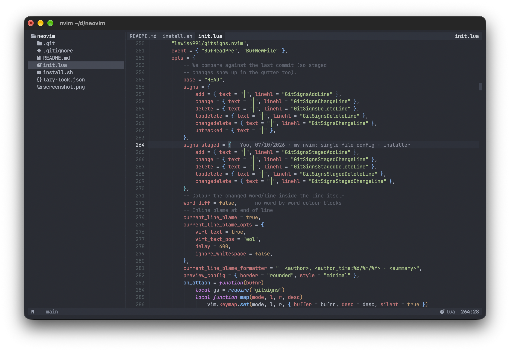

# my nvim

My personal Neovim config, plus an installer, so the same editor comes up on any
machine — my laptop, a server, or the VMs we work on all day.

The point is to **be at home everywhere**: clone the repo, run one script, and
everything is there (colours, explorer, tabs, LSP, git diff, completion, search)
instead of rebuilding an editor from scratch or hand-editing a config over SSH.



*A project folder opened with `nvim <dir>`: explorer on the left, file tabs and
breadcrumb on top, syntax colouring, statusline at the bottom.*

Everything lives in **one file**, `init.lua` (~1,470 lines, comments in English). No
`lua/` modules, on purpose: readable top to bottom, easy to diff, easy to carry.

## Requirements

Works on macOS and Linux: the installer detects the platform and picks the right
package manager (Homebrew, apt, dnf, pacman, zypper, apk).

| Tool | Why | macOS | Linux |
|---|---|---|---|
| Neovim ≥ 0.11 (tested 0.12.5) | `vim.lsp.config`, winbar regions | `brew install neovim` | distro packages are often too old — use the tarball or AppImage from the Neovim releases (or the unstable PPA / snap) |
| `tree-sitter` CLI | builds the parsers | `brew install tree-sitter` | `cargo install tree-sitter-cli` |
| `rg` | text search (telescope) | `brew install ripgrep` | `apt install ripgrep` (or dnf/pacman) |
| `rust-analyzer` | Rust LSP | `rustup component add rust-analyzer` | same |
| `clangd` | C/C++ LSP (optional) | Xcode command line tools | `apt install clangd` |
| clipboard (`wl-copy` / `xclip`) | system yanks on Linux | not needed | required by `clipboard = "unnamedplus"` |

A Nerd Font is required for the explorer and file icons (tuned on JetBrainsMono Nerd
Font). Without one you get boxes instead of glyphs.

## Install

```sh
git clone <this repo> ~/dev/neovim    # or copy the folder over
cd ~/dev/neovim
./install.sh            # copy into ~/.config/nvim + plugins + missing parsers
./install.sh --deps     # also install missing tools with the system package manager
./install.sh --link     # symlink instead of copy (edit here, nvim reads there)
```

Anything already in `~/.config/nvim` is backed up to `~/.config/nvim.bak.<epoch>`
first, and the script is safe to re-run.

To try it without touching the real setup — handy on a shared VM:

```sh
NVIM_APPNAME=nvim-test ./install.sh
NVIM_APPNAME=nvim-test nvim
```

## What's in the box

`init.lua`: 22 sectioned blocks, 60 keymaps, 42 options, 10 autocmds, 157 highlight
definitions, 16 guarded helpers.

19 plugins, pinned in `lazy-lock.json` so a fresh install is reproducible: onedarkpro
(One Dark), nvim-treesitter, nvim-lspconfig + mason, blink.cmp, lualine, neo-tree,
telescope, which-key, gitsigns, satellite, indent-blankline, nvim-web-devicons,
friendly-snippets, plenary, nui, lazy.

28 tree-sitter parsers: rust, lua, vim, markdown, json, toml, yaml, bash, python, go,
javascript/typescript/tsx, html, css, c/cpp, diff, dockerfile, gitignore, gitcommit,
git_rebase, make, regex, query, comment.

## Behaviour worth knowing

- **Tabs** are drawn by hand in the code window's header: labels on the left, file path
  on the right, one single row. Left click switches, **right click closes** — only the
  tab under the cursor, and never one with unsaved changes.
- **The code window never collapses**: closing the last file it shows puts another
  listed file there first, otherwise Neovim drops the window and the tab bar with it.
- **Diff**: a continuous `┃` bar in the gutter (block glyphs render dotted), a light
  10 % line tint, no word-diff; the scrollbar carries the same marks (`▐`) and clicking
  or dragging it navigates — snapping onto a change when you click on one.
- **`nvim <dir>`** opens the explorer and auto-opens the project README in the code
  window if there is one.
- Mouse mappings for the scrollbar are **buffer-local to file buffers**, so the
  explorer keeps its native behaviour (double-click opens a file, `l`/`h` walk the
  tree).
- LSP: rust-analyzer with clippy on save, inlay hints, lens. **clangd is scoped to
  C/C++ filetypes with real root markers** — unscoped it attaches inside Rust repos
  and raises `fe_expected_compiler_job`, which becomes a blocking prompt.

## Gotchas

- No parser build runs at startup, by design. To add a language: `:TSInstall <lang>`,
  then add it to `PARSERS` in `install.sh`.
- `cmdheight = 0`: **any** error or LSP message becomes a blocking "Press ENTER"
  prompt, and while it waits nothing responds — no clicks, no keys. Keep messages
  quiet rather than raising the command line.
- `bufferline.nvim` is still in `lazy-lock.json` but no longer referenced by the
  config: leftover to clean up.
- Terminal settings do not travel with this repo: background transparency and the
  cursor shape/colour belong to the terminal emulator's profile, not to nvim.
- The tab bar (rendering, click regions, window collapsing) is the most fragile part
  of the file: it is hand-made.

## Reverting

```sh
rm -rf ~/.config/nvim && mv ~/.config/nvim.bak.<epoch> ~/.config/nvim
```